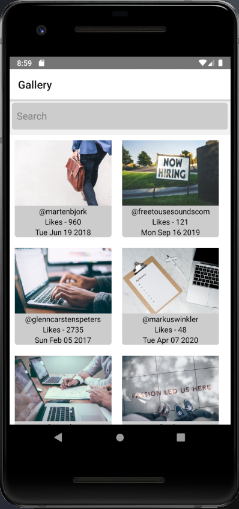
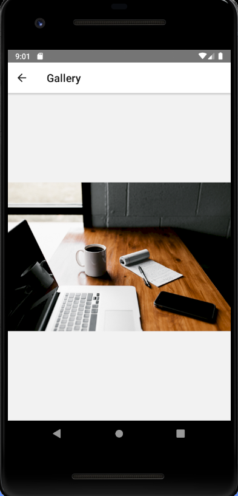
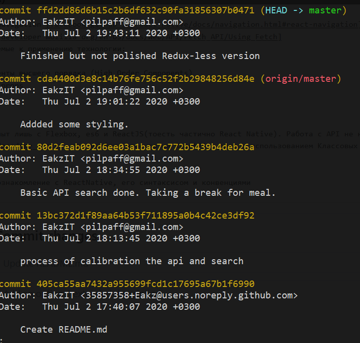

# react-native-gallery
DEVSTEAM.mobi interview assignment
BASIC interview assignment.
Тестовое задание:
Реализовать галерею на базе React-Native (не React.js) которая будет отображать фотографии из unsplash. Это приложение должно извлекать ресурс в формате JSON.
Приложение должно содержать два экрана(страницы):
* Список
- мини изображение с названием и автором
- когда пользователь нажимает на изображение, открывается экран фотографии 
* Фотография
- отображает одну фотографию с максимальной площадью.

Предпочтительнее инициировать приложение через React Native CLI с помощью команды - react-native init TestApp, нежели чем через команду - create-react-native-app, если ресурсы вашего компьютера позволяют.

Внешний вид:

Summary: Задание пришло на почту 29/07/2020 в 13:30. К сожалению приступить к работе получилось лишь на следующий день. Среди перечисленных технологий.

Необходимые к применению технологии:
* React-Native
* Redux + Async Redux library (redux-thunk, redux-saga, e.g.)
* es6 (JS)
* Flexbox
* React Navigation [facebook github io/react-native/docs/navigation.html#react-navigation]
* fetch [developer mozilla org/en-US/docs/Web/API/Fetch_API/Using_Fetch]
Предлагаемые к применению технологии:
* Hooks
* компоненты высшего порядка (High Order Components)
* render props
* ref

Я имел опыт лишь с Flexbox, es6 и ReactJS(тоесть частично React Native). Работа с API не нова, поэтому я сразу знал как это должно делаться(https://github.com/Eakz/codecademy_react - два учебных проекта на ReactJS - один с использованием Классовых компонентов, Другой с использованием функциональных компонентов и хуков).

Итого затрачено:
2 дня(неполных) - ознакомление с ReactNative, его синтаксисом и конвенциями
2 часа - переход с ExpoCLI+PhysicalDevice на React-Native init APP + AndroidStudioEmulator...Да, было больно
3 часа - написание версии без Redux

Версия с Redux и OAuth2 в разработке.
